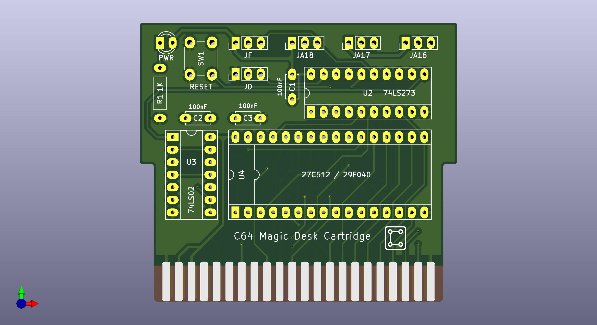
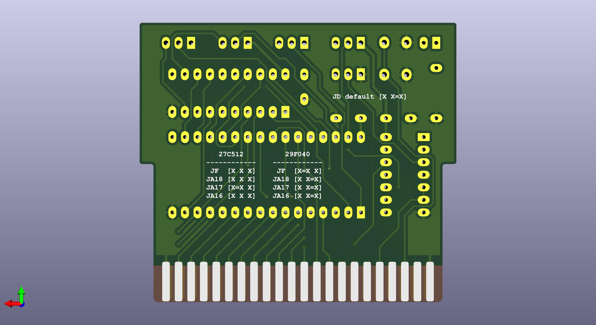

# C64 Magic Desk Cartridge

An open-source hardware clone of the **Magic Desk** cartridge format for the Commodore 64. Supports both **27C512** (64KB) and **29F040** (512KB) EPROMs/EEPROMs, with bank switching handled by a classic 74LS273 + 74LS02 glue logic combination.

This board is designed to be built with through-hole components and DIP sockets, making it easy to assemble, reprogram, and experiment with.

| Front | Back |
|-------|------|
|  |  |

---

## What is the Magic Desk Format?

Magic Desk is a simple and well-documented C64 cartridge format originally used by Commodore for titles like *Ghostbusters*, *Winter Games*, and others. It works by bank-switching 8KB ROM banks into the C64's memory map at `$8000`. A single byte write to `$DE00` selects the active bank; bit 7 controls the EXROM line to enable or disable the cartridge.
Because of its simplicity and wide software support, it became a popular format for homebrew multicarts and game compilations.

---

## Features

- Supports **27C512** (64KB) and **29F040** (512KB)
- Standard C64 cartridge edge connector
- DIP sockets for all ICs — easy to swap and reprogram
- PWR LED indicator
- RESET button
- Jumper configuration for ROM type

---

## Bill of Materials

| Ref | Qty | Value | Package |
|-----|-----|-------|---------|
| C1, C2, C3 | 3 | 100nF | Disc, 5.00mm pitch |
| R1 | 1 | 1K | Axial, horizontal |
| D1 | 1 | LED (PWR) | 3mm |
| U2 | 1 | 74LS273 | DIP-20, socket |
| U3 | 1 | 74LS02 | DIP-14, socket |
| U4 | 1 | 27C512 or 29F040 | DIP-32, socket |
| SW1 | 1 | RESET | Tactile push button 6mm |

---

## Jumper Configuration

The back of the board has a jumper table printed in silkscreen for quick reference. Configure the jumpers according to the ROM you are using:

### JD — default bank select (controls EXROM / cartridge enable)

| JD | Meaning |
|----|---------|
| X X=X | Cartridge always enabled |

### Address line jumpers (JF, JA16, JA17, JA18)

These select which address lines are connected, depending on the ROM size installed.

#### 27C512 (64KB)

| Jumper | Setting |
|--------|---------|
| JF | X X X |
| JA18 | X X X |
| JA17 | X=X X |
| JA16 | X X X |

#### 29F040 (512KB)

| Jumper | Setting |
|--------|---------|
| JF | X=X X |
| JA18 | X X=X |
| JA17 | X X=X |
| JA16 | X X=X |

> **[X=X]** means the two pads are bridged with a solder jumper or jumper cap. **[X X X]** means left open.

Refer to the silkscreen on the back of the board for the full table.

---

## ROM Images

This repository includes pre-compiled **512KB `.bin` files** ready to be burned directly to a **29F040** EEPROM. Each image is a Magic Desk format multicart containing a curated selection of C64 software.

```
roms/
└── *.bin    # Ready-to-burn 512KB images for 29F040
```

To burn a `.bin` file to a 29F040, use a programmer such as:
- TL866II Plus / T48 (xgecu)
- GQ-4X
- Any EPROM programmer that supports the 29F040

---

## Creating Your Own ROM Image

Use the **Magic Desk Cartridge Generator** by Zzarko to build your own `.bin` files from `.prg` or `.crt` files:

- [Magic Desk Cartridge Generator V3.0](https://csdb.dk/release/?id=179083) — original release
- [Magic Desk Cartridge Generator V3.5](https://csdb.dk/release/?id=205274) — newer version (recommended)
- [Source on Bitbucket](https://bitbucket.org/zzarko/magic-desk-cartridge-generator/)

The generator creates a menu-driven launcher that lets you select titles directly on the C64, with no extra hardware needed.

---

## Building the PCB

1. **Order the PCB** — use the Gerber files in `gerbers/`. Standard 2-layer 1.6mm FR4. JLCPCB, PCBWay, etc.
2. **Solder passives first** — capacitors, resistor, LED.
3. **Solder the edge connector** — take care with alignment; the card edge fingers go toward the bottom.
4. **Solder the DIP sockets** — do not solder ICs directly; use sockets so chips can be swapped.
5. **Configure jumpers** — set JF, JD, JA16, JA17, JA18 for your ROM type before inserting the chip.
6. **Insert ICs** — 74LS273, 74LS02, and your programmed EPROM/EEPROM.
7. **Insert into C64** — power on; the cartridge menu should appear immediately.

---

## Compatibility

Tested on:
- Commodore 64 (breadbin and short board)

Should work on:
- Commodore 64C
- Commodore 128 (in C64 mode)

---

## Related Projects

- [Magic Desk Cartridge Generator V3.5](https://csdb.dk/release/?id=205274) by Zzarko — the tool used to build the ROM images
- [Pi1541-Simple-HAT](https://github.com/r0b0t1cu/Pi1541-Simple-HAT) — Raspberry Pi HAT for Pi1541 disk emulation

---

## License

This project is open-source hardware released under the [CERN Open Hardware Licence v2 - Permissive (CERN-OHL-P)](https://ohwr.org/cern_ohl_p_v2.txt).

The Magic Desk Cartridge Generator is the work of Zzarko / Once Upon A Byte and is licensed separately.

---

## Author

Designed by [r0b0t1cu](https://github.com/r0b0t1cu) — 2026
